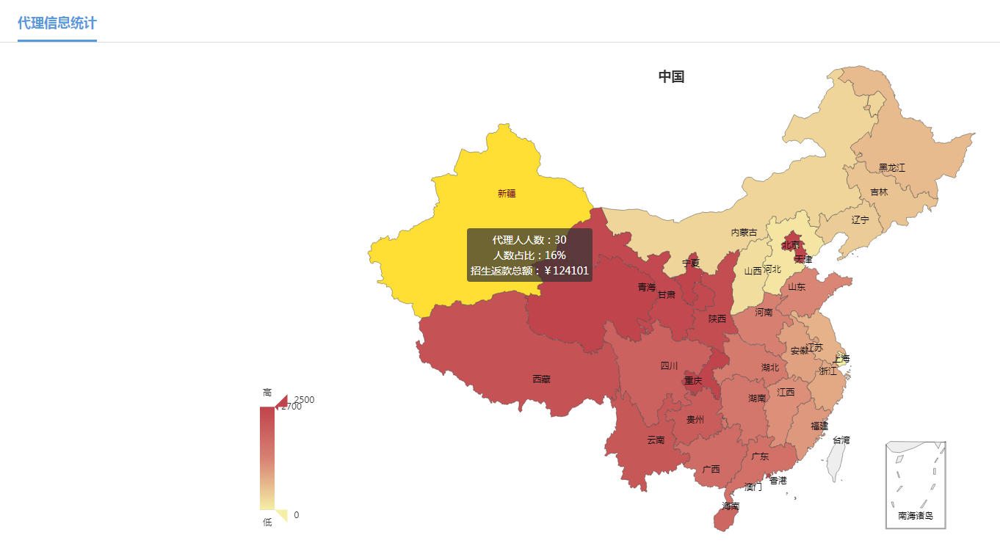

# ReadMe

## 1、Files

- 主要文件

```
- index.html							主框架页面
	- login.html						登录页面
	- view-home.html					主页(二级管理员)
	- view-home-project-detail.html		主页内容详情
	- view-student						表单通用页面(虽然最初是为学员页面所设计的)
	- view-msg-check.html				消息通知列表(学员审核|项目审核)
	- view-msg-detail.html				通知详情(学员审核|项目审核)
	- view-depstruct.html				部门管理(ElementUI-Tree)
	- delegate-info-count.html			(这个见地图表那块)
```

- Vue文件

```
/vue-dialog		弹出框目录
	/d-安排面授
	/d-发票信息
	/d-考试信息
	/d-审核
	/d-时间轴-状态
	/d-证书信息
	/xd-单一的提示
		- dg-export.vue	导出提示
		- dg-mail.vue		邮寄信息
		- dg-reject.vue	驳回对话框

/vue-form-panel	表单弹出框目录
	/添加学员和添加项目(quill编辑器支持)
	/新增成本
	/新增角色
	- add-department.vue	添加部门
	- add-member.vue		添加成员(员工)(含代理人登录下的添加成员)
	- add-notice.vue		添加公告(quill编辑器支持)
	- add-role.vue			添加角色
	- add-student.vue		学员学员
	- Test_FormPage.html	测试页面

注1:新增公司\进款账号\交款方式(这些只是----通用,名字不同)
注2:忽略了单一的提示框消息,类似Alert和Confirm的;
```

## 2、Libary

### 主要框架

1. Vue.js
2. Element-UI

### 1. Vue文件加载插件:http-vue-loader

> [http-vue-loader](https://github.com/FranckFreiburger/http-vue-loader#readme)

- 使用注意:
	1. 至少得使用本地服务器使用该插件,比如HBuiler的127.0.0.1和localhost;
	2. 相关参考,[vue使用http-vue-loader 来运行.vue格式的文件](https://blog.csdn.net/mp624183768/article/details/88387044)

### 2. 富文本插件:Quill


### 3. 数据可视化:Charts

> `/vue-echarts/vue-echarts-map`



## 3、Bug

### bug1

在子组件中引入quill导致,然后watch监听,导致光标一直在行首的问题;
改成了使用v-if的形式,并且使用setIn

### bug2

使用http-vue-loader的确实现了组件分离,但即便弹出框作为单独的html页面也是可以的.


### bug3
- [router-link点击后F12出现[Vue warn]: $attrs is readonly](https://blog.csdn.net/hbwang_716/article/details/84031632);
	- 删除多余的引入文件

### bug4

```
Property "_vlist" must be accessed with "$data._vlist" because properties starting with "$" or "_" are not proxied in the Vue instance to prevent conflicts with Vue internalsSee:
属性“_vlist”必须使用“$data”访问。因为以“$”或“_”开头的属性在Vue实例中没有代理，以防止与Vue内部发生冲突。
```

- 不能在vue里面定义一个名为 `_`开头的的变量;虽然传参的虚参数可以;

### bug5

- ElementUI 在表单默认只有一个el-input的时候,默认提交(即会刷新页面);

### bug6

样式文件默认body是隐藏,在页面加载完成后会显示;下面这句话是必要的(如果页面无法显示):

```js
mounted(){document.body.style.visibility="visible";}
```

### bug7

- `onresiez`重置窗口的时候,需要`*{padding:0;margin:0}`;

### bug8

- 为了美观起见,iframe可能需要,但是直接销毁scrollbar比较好;

```html
<iframe style="overflow: visible;"></iframe>
```

### bug9:el-input

```html
<@input="getText" @change.native="getText" @blur="getText">
```